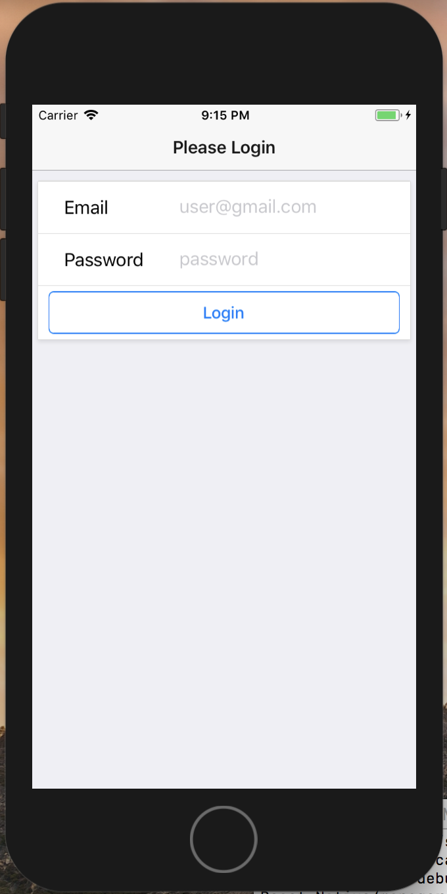

# React-Native Manager App

- Mobile App to Manage Employee's and Shifts

# Purpose 

* Users can sign in to access their manager portal.

* Once logged in, Users can add employee names, phone numbers, and schedule day of the week. 

* Managers can then Edit the list of Employees, Delete them, and even text them their next shift. 

## App Functionality:

- App uses React-native with Redux 

- React-native Scenes used for page changes

- Texting using React-Native-Communications

- Data persists through firebase and is stored by user

### Screenshots:

